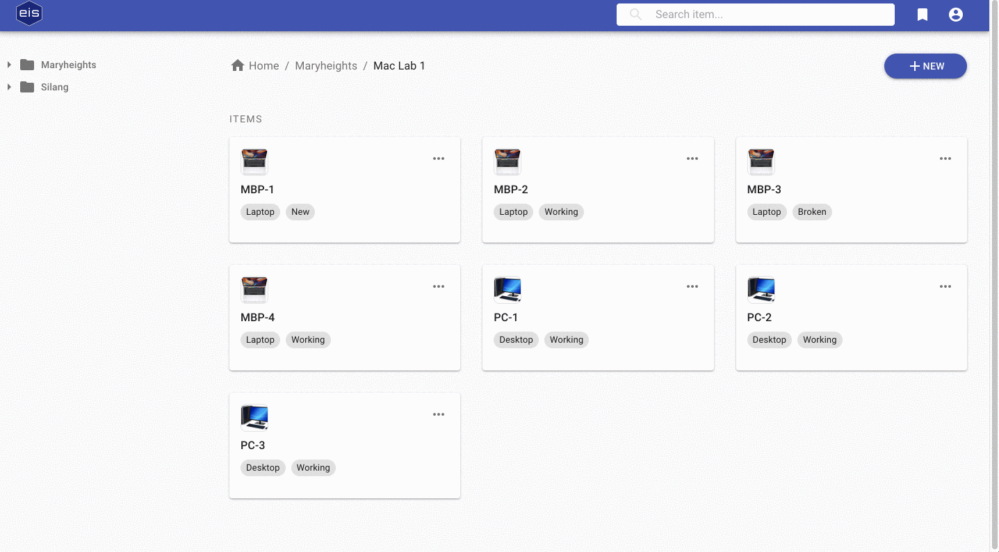
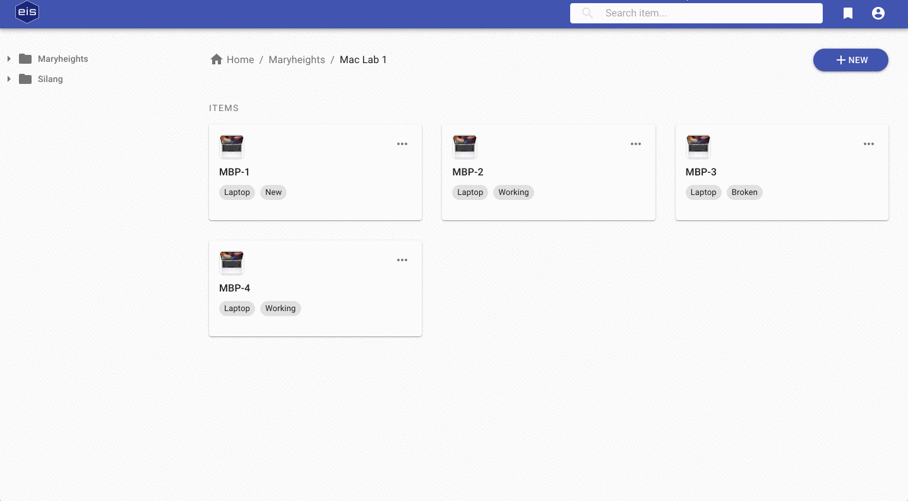

# Equipment Inventory System (EIS)
**EIS** is a web application for tracking and managing equipment inventory

---

## Technologies & Frameworks
  - React (with Hooks)
  - Redux
  - Node.js
  - Express.js
  - MongoDB & Mongoose
  - JWT
  - Material-UI
  - Amazon S3
  
### Other Libraries
  - aws-sdk
  - final-form
  - validator
  - multer
  - axios
  - bcryptjs
  - passport

---

## Features
### Item Management
EIS enables users to define and add items into their system. Item name, category, condition, and thumbnails 
are the default fields for an item, however, users may add custom fields of an item in the *Properties* section.

Properties are custom fields that describe attributes of an item. For example, a laptop may have properties 
such as processor, storage capacity, and price. Users can define any property they want in order to represent 
any item.

EIS allows users to add supporting information of an item through *notes* and *attachments*. Notes may be any 
important message such as a message informing the user how an item was broken or who borrowed the equipment.
Attachments are relevant files associated to an item. These files may be software license, receipts, and images.

---

### Folder Organization
EIS organizes items into folders in order to keep related records together. Nesting folders is possible 
in order to support different ways to organize items. EIS also enables users to move items and folders into another
folder in case an item was moved or a different folder organization is adopted.

---

### Templates
EIS provides users a way to create item templates for items that have standard fields (e.g., properties, attachments, 
and notes). These templates may be used to pre-populate fields when creating new items into different folders. 

---

### Search
EIS is capable of searching for items by id, name, category, condition, properties, and notes. 

